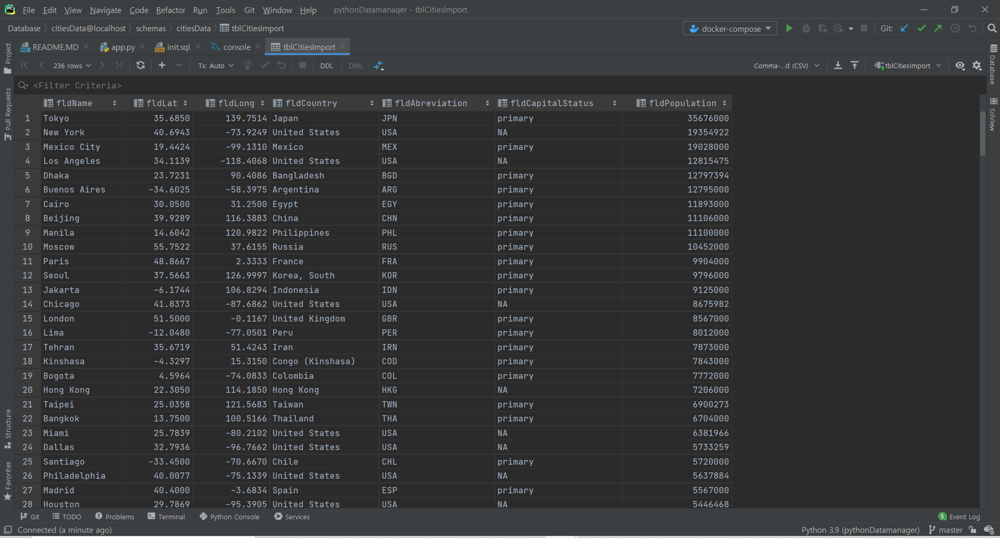
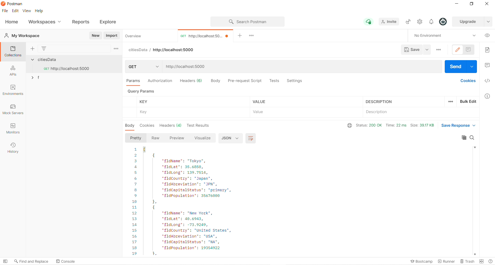
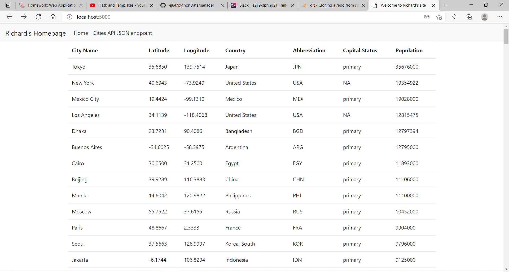

# Project Description
This project is a homework assignment to teach how to get Pycharm setup with Docker, Flask, MySQL
## IS218 - Richard Jeong
# Pycharm Database Screenshot

# Postman Screenshot

# Web Browser Screenshot

